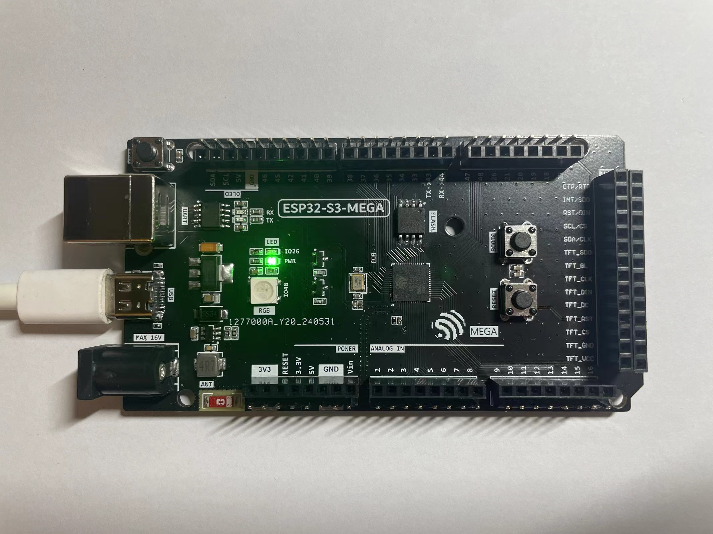
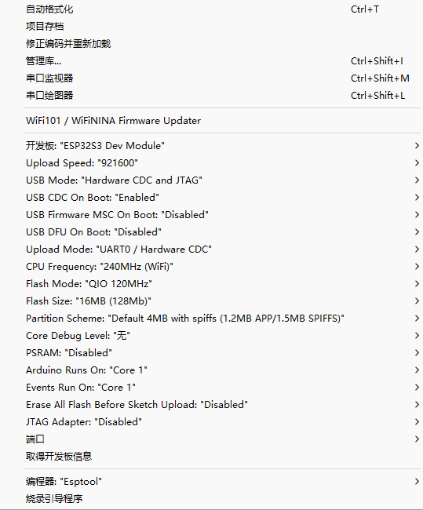
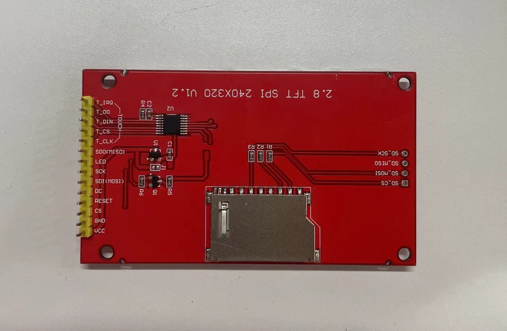
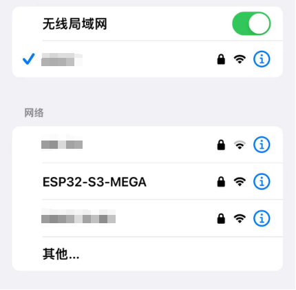

 # ESP32-S3-MEGA

> ESP32-S3-MEGA基于[ESP32-S3 SOC](https://www.espressif.com/sites/default/files/documentation/esp32-s3_datasheet_en.pdf)，[Arduino Mega 2560](https://store.arduino.cc/products/arduino-mega-2560-rev3)板外形。基本兼容Arduino Mega 2560盾板及开发套件。

**参数：** 硬件基于`ESP32-S3`芯片，最大可支持输入电源电压`DC 16V`，下载模式`USB`或`UART`，平台支持`Arduino`、`ESP-IDF`、`Platform-IO`、`MicroPython`。

---
## 关于本项目

#### 开发板资源：
- 所有引脚引出
- 一个自定义按键 GPIO46
- 一个发光LED GPIO26
- 一个RGB灯珠 GPIO48
- 一个4Pin I2C接口OLED屏幕插口
- 一个通用TFT+电阻触摸屏幕插口
- 一个通用TFT+电容触摸屏幕插口
- USB Type-C 下载/串口
- USB Type-B 下载/串口
- DC电源输入 最大电压16V
- 2.4GHz 板载天线
- 大小可选Flash

>请注意！在开发板上方第一排针脚SDA/SCL/5V/GND与Arduino Mega 2560的引脚不相符，Arduino Mega 2560的引脚顺序为SCL/SDA/5V/GND。此设计是为了能够直插4Pin I2C接口的OLED屏幕便于开发。

## 使用说明

#### 1. 打样说明

直接用 **`Fabrication`** 文件夹里的 **`GERBER for ESP32 MEGA`** 文件打样即可：2层PCB，无特殊工艺要求；大小 **`10mm*53.34mm`** ，我在Arduino Mega 2560标准PCB外型上适当做了缩减以满足各PCB板厂的免费打样要求。

#### 2. 采购清单

打开 **`Fabrication`** 文件夹里的 **`BOM for ESP32 MEGA`** 文件查看。

>注意事项：
1.ESP32-S3型号选择：
如使用 **ESP32-S3Rx** 系列，需要焊接外置FLASH。
如使用 **ESP32-S3Fx** 系列，可不焊接外置FLASH。
如使用 **ESP32-S3-Pico**，可不焊接FLASH以及晶振电路。
*建议组合：ESP32-S3R8 + 16Mb Flash。*
2、10uF钽电容可以使用0805封装的MLCC代替。如使用钽电容，请注意极性方向。
3、贴片天线请使用CrossAir CA03型号，或能够符合封装大小的其他厂商的贴片天线，频率2.4GHz。
4、肖特基二极管SS34可替换为SS14、SS24等。
5、FLASH大小可自由选择。
6、发光二极管的分压电阻请根据LED颜色来更换大小，避免造成过亮或过暗的情况，默认1KΩ。

#### 3. 焊接注意事项

##### 需要的焊接工具：
1. 烙铁 **（必须）**
2. 热风枪 **（必须）**
3. 加热台（可选）
4. 助焊剂 **（必须）**

##### 焊接技巧

1. ESP32-S3芯片采用QFN封装，大部分上电检测不到芯片原因是因为空焊虚焊。建议先在芯片上用烙铁均匀上锡，*注意散热片不要加过量锡*；再用热风枪将其吹到焊盘上；最后用烙铁沾锡配合助焊剂将芯片四周均匀上锡；观察四周引脚没有虚焊没有连锡即可。
2. WS2812不建议使用热风枪直吹，WS2812外壳不耐高温，高温容易吹化白色外壳。可以使用电烙铁或加热台。
3. 发光LED如果长时间受热容易发黄，请使用烙铁或加热台或短暂的热风枪吹焊。

#### 4. 关于第一次上电

芯片第一次上电下载程序需要在上电前按下 **`BOOT0`** 按键，上电后可松开。或上电后同时按下 **`BOOT0`** 和 **`RESET`** ，然后先松开 **`RESET`**，再松开 **`BOOT0`** 以进入 **`Joint Download Boot`** 模式。此时串口会显示 **`"waiting for download"`**，即可烧录程序。
当FLASH已有烧录过的程序后，第二次下载程序无需再进行下拉`BOOT0`等操作，芯片会自动下载。

#### 5. 关于Arduino USB下载

>ESP32-S3集成了全速 **USB-OTG** 接口，可以使用 **`USB`** 下载固件或 **`USB串口`**。

在Arduino **`工具栏`** 设置如下图所示

如果使用 **`USB`** 下载，板子上电后，应能够在`端口`处看到对应的COM口和芯片型号，如没有显示，请排查原因。

#### 5. 关于TFT屏幕接口

开发板自带两个TFT触摸屏接口，采用的引脚模式与市面上能买到的最基础的TFT触摸屏相符合，引脚顺序为：

| 电容屏  | 电阻屏  |
| ------- | ------- |
| NC      | NC      |
| TP_INT  | TP_DO   |
| TP_RST  | TP_DIN  |
| TP_SCL  | TP_CS   |
| TP_SDA  | TP_CLK  |
| TFT_SDO | TFT_SDO |
| TFT_BL  | TFT_BL  |
| TFT_CLK | TFT_CLK |
| TFT_DIN | TFT_DIN |
| TFT_DC  | TFT_DC  |
| TFT_RST | TFT_RST |
| TFT_CS  | TFT_CS  |
| GND     | GND     |
| VCC     | VCC     |

测试使用的屏幕为2.8寸TFT屏，如下图:

    
    

LVGL测试效果如下：

    

#### 6. 关于I2C OLED接口

在开发板左上角集成了一个I2C OLED接口，可以直插4线 I2C OLED屏幕，引脚图如下：
| 功能 | 引脚   |
| ---- | ------ |
| SDA  | GPIO8  |
| SCL  | GPIO18 |
| VCC  | 5V     |
| GND  | GND    |

测试结果如下图：

    

#### 7. WIFI测试

使用 Arduino 官方`WiFiAccessPoint`示例程序，使用手机搜索AP节点如下图：

    

## 欢迎star支持 :D